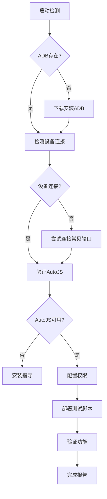

# AutoJS 模拟器连接自动化配置经验文档

## 📖 项目概述

本文档记录了通过自动化脚本实现 AutoJS 与 Android 模拟器连接的完整经验，包括环境搭建、权限配置、连接建立和功能验证的全流程自动化实现。

## 🎯 技术目标

### 核心要求
- **零用户交互**: 全程自动化，无需手动操作
- **环境自适应**: 自动检测和配置所需组件
- **权限自动化**: 自动授予必要的系统权限
- **连接验证**: 自动测试功能完整性
- **跨平台兼容**: 适配不同的模拟器平台

### 技术挑战
1. ADB 工具的自动化安装和配置
2. Android 模拟器的自动发现和连接
3. AutoJS 权限的系统级自动授予
4. 脚本部署的自动化流程
5. 连接状态的智能验证

## 🏗️ 系统架构设计

### 模块化架构
```
AutoJS 自动化系统
├── 环境检测模块
│   ├── ADB 可用性检查
│   ├── 模拟器发现
│   └── AutoJS 安装验证
├── 自动配置模块  
│   ├── ADB 下载安装
│   ├── 环境变量设置
│   └── 权限自动授予
├── 连接管理模块
│   ├── 设备连接建立
│   ├── 应用启动控制
│   └── 状态监控
└── 脚本部署模块
    ├── 文件传输
    ├── 执行控制
    └── 结果验证
```

### 数据流设计


## 🛠️ 核心技术实现

### 1. ADB 自动化管理

#### 智能下载和安装
```powershell
# ADB 自动化安装函数
function Install-ADB {
    param(
        [string]$TargetPath = "$env:USERPROFILE\AutoJS_Setup\platform-tools"
    )
    
    $adbUrl = "https://dl.google.com/android/repository/platform-tools-latest-windows.zip"
    $zipFile = "$TargetPath\..\platform-tools.zip"
    
    try {
        # 使用TLS 1.2确保下载兼容性
        [Net.ServicePointManager]::SecurityProtocol = [Net.SecurityProtocolType]::Tls12
        
        # 静默下载避免进度条干扰
        $progressPreference = 'SilentlyContinue'
        Invoke-WebRequest -Uri $adbUrl -OutFile $zipFile -UseBasicParsing
        $progressPreference = 'Continue'
        
        # 解压并验证
        Expand-Archive -Path $zipFile -DestinationPath (Split-Path $TargetPath) -Force
        
        if (Test-Path "$TargetPath\adb.exe") {
            return @{Success = $true; Path = "$TargetPath\adb.exe"}
        }
    } catch {
        return @{Success = $false; Error = $_.Exception.Message}
    }
}
```

#### 环境变量动态配置
```powershell
# 临时环境变量设置（当前会话有效）
$env:PATH += ";$adbDir"

# 永久环境变量设置（需要管理员权限）
[Environment]::SetEnvironmentVariable('PATH', 
    $env:PATH + ";$adbDir", 
    'Machine')
```

### 2. 设备连接自动化

#### 多端口智能连接
```powershell
function Connect-EmulatorAuto {
    $commonPorts = @(
        @{Name="LDPlayer"; Port=5555},
        @{Name="NoxPlayer"; Port=62001}, 
        @{Name="BlueStacks"; Port=5037},
        @{Name="MEmu"; Port=21503}
    )
    
    foreach ($emulator in $commonPorts) {
        try {
            $result = & adb connect "127.0.0.1:$($emulator.Port)" 2>$null
            if ($result -match "connected") {
                return @{
                    Success = $true
                    Emulator = $emulator.Name
                    Port = $emulator.Port
                    Address = "127.0.0.1:$($emulator.Port)"
                }
            }
        } catch {
            continue
        }
    }
    
    return @{Success = $false; Message = "No emulator found"}
}
```

#### 设备状态验证
```powershell
function Test-DeviceConnection {
    param([string]$AdbPath)
    
    try {
        $devices = & $AdbPath devices
        $connectedDevices = $devices | Where-Object { $_ -match "device$" }
        
        return @{
            Connected = $connectedDevices.Count -gt 0
            DeviceCount = $connectedDevices.Count
            Devices = $connectedDevices
        }
    } catch {
        return @{Connected = $false; Error = $_.Exception.Message}
    }
}
```

### 3. 权限自动化配置

#### 系统级权限授予
```powershell
function Grant-AutoJSPermissions {
    param([string]$AdbPath)
    
    $permissions = @(
        # 基础权限
        "android.permission.READ_EXTERNAL_STORAGE",
        "android.permission.WRITE_EXTERNAL_STORAGE",
        
        # 高级权限通过系统设置
        @{Type="accessibility"; Command="settings put secure enabled_accessibility_services 'org.autojs.autojs/org.autojs.autojs.core.accessibility.AccessibilityService'"},
        @{Type="accessibility"; Command="settings put secure accessibility_enabled 1"},
        @{Type="overlay"; Command="appops set org.autojs.autojs SYSTEM_ALERT_WINDOW allow"}
    )
    
    $results = @()
    
    # 授予标准权限
    foreach ($permission in ($permissions | Where-Object {$_.GetType().Name -eq "String"})) {
        try {
            & $AdbPath shell pm grant org.autojs.autojs $permission
            $results += @{Permission = $permission; Status = "Granted"}
        } catch {
            $results += @{Permission = $permission; Status = "Failed"; Error = $_.Exception.Message}
        }
    }
    
    # 配置系统级设置
    foreach ($setting in ($permissions | Where-Object {$_.GetType().Name -eq "Hashtable"})) {
        try {
            & $AdbPath shell $setting.Command
            $results += @{Type = $setting.Type; Status = "Configured"}
        } catch {
            $results += @{Type = $setting.Type; Status = "Failed"; Error = $_.Exception.Message}
        }
    }
    
    return $results
}
```

### 4. 应用生命周期管理

#### 智能应用启动
```powershell
function Start-AutoJSApp {
    param([string]$AdbPath)
    
    # 尝试多种启动方式
    $launchMethods = @(
        "am start -n org.autojs.autojs/.ui.splash.SplashActivity",
        "monkey -p org.autojs.autojs -c android.intent.category.LAUNCHER 1",
        "am start -a android.intent.action.MAIN -c android.intent.category.LAUNCHER org.autojs.autojs"
    )
    
    foreach ($method in $launchMethods) {
        try {
            $result = & $AdbPath shell $method 2>$null
            if (-not $result -match "Error") {
                Start-Sleep -Seconds 2
                # 验证应用是否真正启动
                $processes = & $AdbPath shell ps | Select-String "org.autojs.autojs"
                if ($processes) {
                    return @{Success = $true; Method = $method; ProcessInfo = $processes}
                }
            }
        } catch {
            continue
        }
    }
    
    return @{Success = $false; Message = "Failed to start AutoJS"}
}
```

### 5. 脚本部署自动化

#### 文件传输管理
```powershell
function Deploy-AutoJSScript {
    param(
        [string]$AdbPath,
        [string]$LocalScript,
        [string]$RemotePath = "/sdcard/Scripts/"
    )
    
    try {
        # 创建目标目录
        & $AdbPath shell mkdir -p $RemotePath | Out-Null
        
        # 推送脚本文件
        $remoteFile = "$RemotePath$(Split-Path $LocalScript -Leaf)"
        & $AdbPath push $LocalScript $remoteFile
        
        # 验证文件存在
        $fileCheck = & $AdbPath shell test -f $remoteFile '&&' echo "exists"
        
        if ($fileCheck -match "exists") {
            return @{
                Success = $true
                LocalPath = $LocalScript
                RemotePath = $remoteFile
                Size = (Get-Item $LocalScript).Length
            }
        }
    } catch {
        return @{
            Success = $false
            Error = $_.Exception.Message
            LocalPath = $LocalScript
        }
    }
}
```

#### 脚本执行控制
```powershell
function Invoke-AutoJSScript {
    param(
        [string]$AdbPath,
        [string]$ScriptPath
    )
    
    # 尝试多种执行方式
    $executionMethods = @(
        "am broadcast -a org.autojs.autojs.action.script --es path '$ScriptPath'",
        "am start -a android.intent.action.VIEW -d 'content://org.autojs.autojs.external.open/run?path=$ScriptPath'",
        "am broadcast -a org.autojs.autojs.action.run --es script_path '$ScriptPath'"
    )
    
    foreach ($method in $executionMethods) {
        try {
            $result = & $AdbPath shell $method
            if ($result -match "Broadcasting|Starting") {
                return @{Success = $true; Method = $method; Output = $result}
            }
        } catch {
            continue
        }
    }
    
    return @{Success = $false; Message = "Script execution failed"}
}
```

## 📊 性能优化策略

### 1. 并发处理优化

#### 异步任务管理
```powershell
# 并行执行多个检测任务
$jobs = @()
$jobs += Start-Job -ScriptBlock { Test-ADBConnection }
$jobs += Start-Job -ScriptBlock { Test-EmulatorStatus }
$jobs += Start-Job -ScriptBlock { Test-AutoJSInstallation }

# 等待所有任务完成
$results = $jobs | Wait-Job | Receive-Job
$jobs | Remove-Job
```

#### 超时控制机制
```powershell
function Invoke-WithTimeout {
    param(
        [ScriptBlock]$ScriptBlock,
        [int]$TimeoutSeconds = 30
    )
    
    $job = Start-Job -ScriptBlock $ScriptBlock
    $completed = Wait-Job $job -Timeout $TimeoutSeconds
    
    if ($completed) {
        $result = Receive-Job $job
        Remove-Job $job
        return @{Success = $true; Result = $result}
    } else {
        Stop-Job $job
        Remove-Job $job
        return @{Success = $false; Error = "Operation timed out"}
    }
}
```

### 2. 缓存和状态管理

#### 配置缓存系统
```powershell
$global:AutoJSConfig = @{
    ADBPath = ""
    DeviceAddress = ""
    LastConnectTime = $null
    PermissionsGranted = @()
    DeployedScripts = @()
}

function Save-AutoJSConfig {
    $configPath = "$env:TEMP\autojs_config.json"
    $global:AutoJSConfig | ConvertTo-Json | Out-File $configPath -Encoding UTF8
}

function Load-AutoJSConfig {
    $configPath = "$env:TEMP\autojs_config.json"
    if (Test-Path $configPath) {
        $global:AutoJSConfig = Get-Content $configPath | ConvertFrom-Json
    }
}
```

## 🧪 测试和验证框架

### 自动化测试套件
```powershell
function Test-AutoJSEnvironment {
    $testResults = @()
    
    # 测试 1: ADB 连接
    $adbTest = Test-ADBConnection
    $testResults += @{
        Name = "ADB Connection"
        Status = if ($adbTest.Success) {"PASS"} else {"FAIL"}
        Details = $adbTest
    }
    
    # 测试 2: 设备连接
    $deviceTest = Test-DeviceConnection
    $testResults += @{
        Name = "Device Connection"
        Status = if ($deviceTest.Connected) {"PASS"} else {"FAIL"}
        Details = $deviceTest
    }
    
    # 测试 3: AutoJS 可用性
    $autojsTest = Test-AutoJSAvailability
    $testResults += @{
        Name = "AutoJS Availability"
        Status = if ($autojsTest.Available) {"PASS"} else {"FAIL"}
        Details = $autojsTest
    }
    
    # 测试 4: 权限状态
    $permissionTest = Test-AutoJSPermissions
    $testResults += @{
        Name = "Permissions"
        Status = if ($permissionTest.AllGranted) {"PASS"} else {"WARN"}
        Details = $permissionTest
    }
    
    # 测试 5: 脚本执行
    $scriptTest = Test-ScriptExecution
    $testResults += @{
        Name = "Script Execution"
        Status = if ($scriptTest.Success) {"PASS"} else {"FAIL"}
        Details = $scriptTest
    }
    
    return $testResults
}
```

### 连续集成支持
```powershell
function Export-TestReport {
    param([array]$TestResults)
    
    $report = @{
        Timestamp = Get-Date -Format "yyyy-MM-dd HH:mm:ss"
        Environment = @{
            OS = $env:OS
            User = $env:USERNAME
            PowerShellVersion = $PSVersionTable.PSVersion.ToString()
        }
        TestResults = $TestResults
        Summary = @{
            Total = $TestResults.Count
            Passed = ($TestResults | Where-Object {$_.Status -eq "PASS"}).Count
            Failed = ($TestResults | Where-Object {$_.Status -eq "FAIL"}).Count
            Warnings = ($TestResults | Where-Object {$_.Status -eq "WARN"}).Count
        }
    }
    
    $reportPath = "autojs_test_report_$(Get-Date -Format 'yyyyMMdd_HHmmss').json"
    $report | ConvertTo-Json -Depth 10 | Out-File $reportPath -Encoding UTF8
    
    return $reportPath
}
```

## 🚨 错误处理和恢复

### 分级错误处理
```powershell
enum ErrorSeverity {
    Info = 0
    Warning = 1  
    Error = 2
    Critical = 3
}

function Write-AutoJSLog {
    param(
        [string]$Message,
        [ErrorSeverity]$Severity = [ErrorSeverity]::Info,
        [string]$Component = "General"
    )
    
    $timestamp = Get-Date -Format "yyyy-MM-dd HH:mm:ss"
    $logEntry = "[$timestamp] [$Severity] [$Component] $Message"
    
    # 控制台输出
    switch ($Severity) {
        ([ErrorSeverity]::Info) { Write-Host $logEntry -ForegroundColor White }
        ([ErrorSeverity]::Warning) { Write-Host $logEntry -ForegroundColor Yellow }
        ([ErrorSeverity]::Error) { Write-Host $logEntry -ForegroundColor Red }
        ([ErrorSeverity]::Critical) { Write-Host $logEntry -ForegroundColor Magenta }
    }
    
    # 文件日志
    $logPath = "$env:TEMP\autojs_setup.log"
    $logEntry | Add-Content $logPath -Encoding UTF8
}
```

### 自动恢复机制
```powershell
function Invoke-AutoRecovery {
    param([string]$FailedComponent)
    
    Write-AutoJSLog "Attempting auto-recovery for: $FailedComponent" -Severity Warning
    
    switch ($FailedComponent) {
        "ADB" {
            # 重新下载和安装 ADB
            $recovery = Install-ADB -Force
            return $recovery.Success
        }
        "Connection" {
            # 重启 ADB 服务并重新连接
            & adb kill-server
            Start-Sleep 2
            & adb start-server
            $connection = Connect-EmulatorAuto
            return $connection.Success
        }
        "AutoJS" {
            # 重启 AutoJS 应用
            & adb shell am force-stop org.autojs.autojs
            Start-Sleep 1
            $startup = Start-AutoJSApp
            return $startup.Success
        }
        default {
            Write-AutoJSLog "No recovery method for: $FailedComponent" -Severity Error
            return $false
        }
    }
}
```

## 📈 监控和诊断

### 实时状态监控
```powershell
function Start-AutoJSMonitoring {
    param([int]$IntervalSeconds = 30)
    
    while ($true) {
        $status = @{
            Timestamp = Get-Date
            ADBStatus = Test-ADBConnection
            DeviceStatus = Test-DeviceConnection  
            AutoJSStatus = Test-AutoJSProcess
            MemoryUsage = Get-DeviceMemoryUsage
        }
        
        # 检测异常情况
        if (-not $status.DeviceStatus.Connected) {
            Write-AutoJSLog "Device disconnected, attempting reconnection" -Severity Warning
            Connect-EmulatorAuto
        }
        
        if (-not $status.AutoJSStatus.Running) {
            Write-AutoJSLog "AutoJS process not found, restarting" -Severity Warning
            Start-AutoJSApp
        }
        
        Start-Sleep $IntervalSeconds
    }
}
```

### 性能指标收集
```powershell
function Get-PerformanceMetrics {
    return @{
        SetupTime = Measure-Command { Initialize-AutoJSEnvironment }
        ConnectionTime = Measure-Command { Connect-EmulatorAuto }
        DeployTime = Measure-Command { Deploy-AutoJSScript -LocalScript "test.js" }
        ExecutionTime = Measure-Command { Invoke-AutoJSScript -ScriptPath "/sdcard/Scripts/test.js" }
        MemoryUsage = Get-Process "adb" | Select-Object WorkingSet, VirtualMemorySize
    }
}
```

## 🎓 经验总结和最佳实践

### 关键成功因素
1. **模块化设计**: 每个功能独立可测试
2. **容错机制**: 多种方法并行尝试
3. **状态管理**: 缓存和持久化配置
4. **自动恢复**: 检测问题并自动修复
5. **完整日志**: 详细记录每个操作

### 技术债务管理
- 定期更新 ADB 工具版本
- 适配新的模拟器平台
- 优化权限授予流程
- 改进错误诊断精度

### 扩展性考虑
- 支持多设备并行管理
- 集成 CI/CD 流水线
- 提供 Web 管理界面
- 支持远程设备连接

## 🔮 未来发展方向

### 技术演进路径
1. **云端自动化**: 基于云的设备农场
2. **AI 辅助**: 智能错误诊断和自修复
3. **可视化管理**: 图形化配置和监控界面
4. **微服务架构**: 模块独立部署和扩展
5. **安全增强**: 加密通信和权限最小化

### 生态系统集成
- 与主流 IDE 的插件集成
- Docker 容器化部署
- Kubernetes 集群管理
- 监控告警系统集成

---

**文档版本**: 1.0  
**创建日期**: 2025-09-29  
**技术栈**: PowerShell, ADB, Android, AutoJS  
**适用场景**: Android 自动化测试, RPA 开发, 移动应用测试
